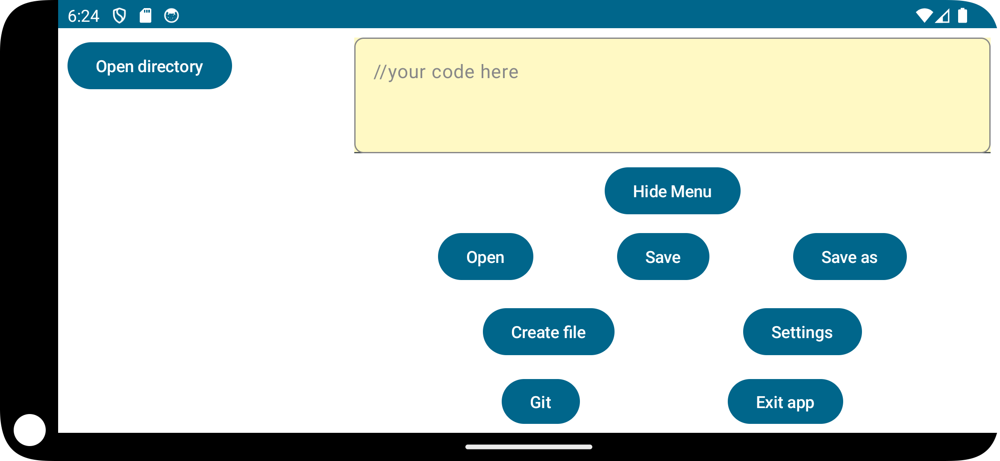
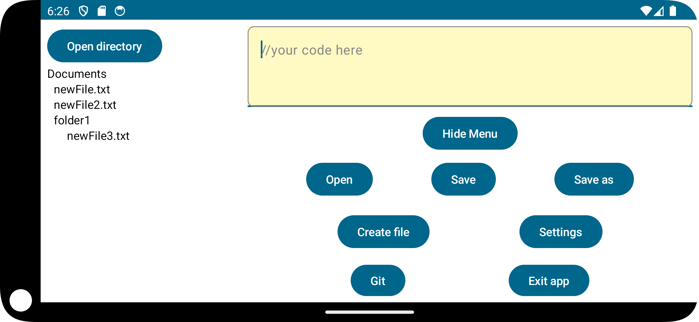
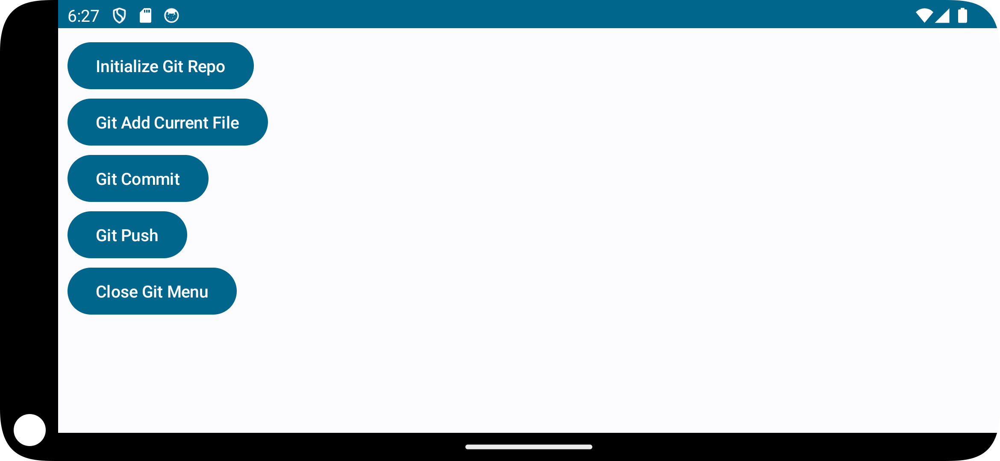
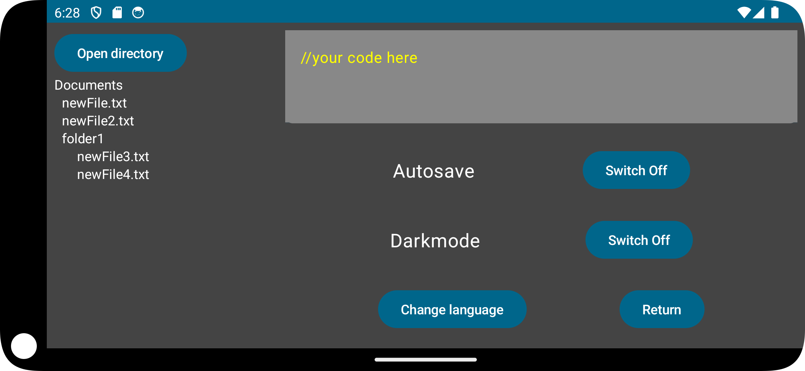

# Installation on Arch

# Features
- Our app is simple code editor for android with smooth interface

- You can open a menu with a bunch of actions, like managing files, entering settings, etc.

- If you are going to work with project, you can open a dedicated folder for it, content of which will be displayed on the left. The directory tree refreshes automatically on any update.

- Also we have a git menu that, unfortunately, doesn't work, but at least buttons look pretty fine

- Last but not least, our app features dark mode and autosave for files

## In folder "researches" you can find PDFs describing problems we faced during working on the project 