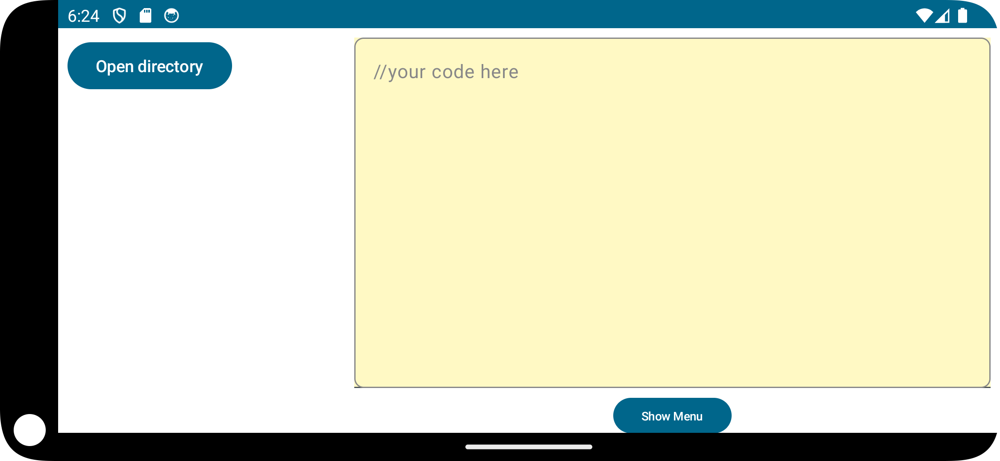

# Installation on Arch

First you need to download Android Studio from AUR.
Here is the link to the package 
https://aur.archlinux.org/packages/android-studio

If you have yay installed, you can just run the following command:
```bash
yay -S android-studio
```
If you don't have yay, you can install it by running the following command:
```bash
sudo pacman -S --needed git base-devel
git clone https://aur.archlinux.org/yay.git
cd yay
makepkg -si
```
If you don't want to download yay, you can download the package manually from the link above. You can install it by running the following command:
```bash
git clone https://aur.archlinux.org/android-studio.git
cd android-studio
makepkg -si
```
Now you need to see what is the name of the package you have just installed. You can do it by running the following command:
```bash
ls
```
Now you need to install the package. You can do it by running the following command:
```bash
sudo pacman -U <package_name>
```

Now you can open Android Studio and install the necessary SDKs and tools. You will need SDK 14 and emulator to see our app on your computer.

You will be able to run our app in android studio by opening the project and running it on the emulator.


# Features
- Our app is simple code editor for android with smooth interface


- You can open a menu with a bunch of actions, like managing files, entering settings, etc.


- If you are going to work with project, you can open a dedicated folder for it, content of which will be displayed on the left. The directory tree refreshes automatically on any update.


- Also we have a git menu that, unfortunately, doesn't work, but at least buttons look pretty fine


- Last but not least, our app features dark mode and autosave for files


## In folder "researches" you can find PDFs describing problems we faced during working on the project 